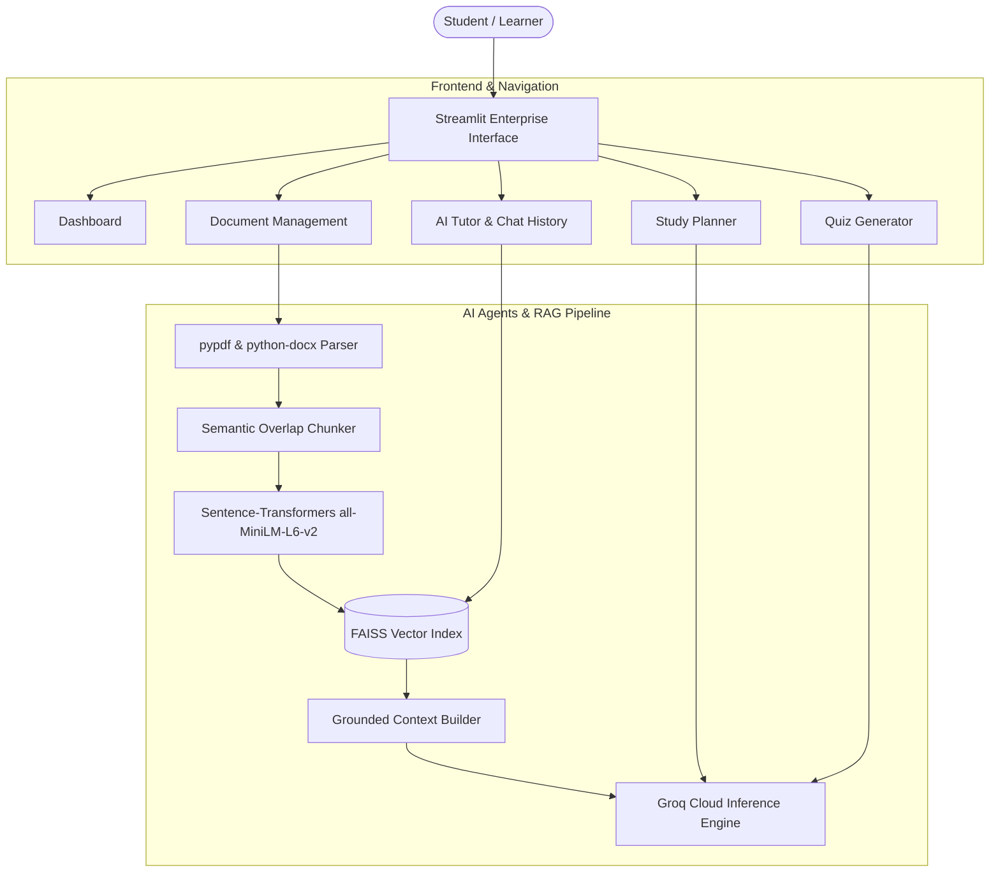

# 🎓 Learning Accelerator – Adaptive AI Academic Tutoring Platform

[](https://www.python.org/)
[](https://streamlit.io/)
[](https://groq.com/)
[](https://github.com/facebookresearch/faiss)
[](LICENSE)
[](https://owasp.org/www-project-top-10-for-large-language-model-applications/)

An enterprise-grade, multi-agent AI academic tutoring platform designed to deliver personalized, grounded, and safe educational learning experiences. Built with **Streamlit**, **Groq LPU Inference**, **FAISS Vector Search**, and **Sentence-Transformers**.

---

## 🌟 Key Features

- **🏛️ Modern Minimalist SaaS UI**: Clean layout, dynamic sidebar navigation, responsive design, and smooth user experience.
- **🤖 Intelligent Multi-Agent System**:
  - **AI Tutor (RAG Explainer)**: Explains concepts grounded in uploaded materials, supports multi-language queries, and handles out-of-scope general inquiries legally and ethically.
  - **Curriculum Planner**: Formulates phased academic roadmaps and daily execution milestones tailored to student timelines and study styles.
  - **Quiz Assessment Generator**: Automatically constructs validated multiple-choice assessments with answer keys and rationale.
  - **Performance Coach**: Analyzes assessment trends and provides diagnostic learning recommendations.
- **⚡ High-Performance RAG Architecture**:
  - Local-first embedding via `all-MiniLM-L6-v2` with zero network rate-limit latency.
  - Sub-second vector retrieval using FAISS IndexFlatIP.
  - Seamless ingestion of **PDF**, **DOCX**, **TXT**, and **Markdown** documents.
- **🌐 Multilingual Intelligence**:
  - Native support and automatic language detection for **UK English**, **USA English**, **Roman Urdu**, and **Urdu (اردو)**.
- **🛡️ Enterprise Security & OWASP LLM Top 10 Compliance**:
  - **LLM01 (Prompt Injection Defense)**: Treats all reference documents as untrusted data; rejects unauthorized role-playing and jailbreaks.
  - **LLM05 (Improper Output Handling)**: Sandboxed Markdown output rendering without raw script execution.
  - **LLM07 (System Prompt Leakage Prevention)**: Guards internal configurations and instructions against social engineering and extraction attempts.
  - **Ethical Content Safeguards**: Strict refusal of inappropriate/explicit/illegal requests, with educational medical disclaimers appended where applicable.

---

## 🏗️ System Architecture



---

## 🚀 Quick Start Guide

### 1. Clone the Repository

```bash
git clone https://github.com/usmancreation/learning-accelerator.git
cd learning-accelerator
```

### 2. Set Up Virtual Environment

```bash
# Windows
python -m venv .venv
.\.venv\Scripts\activate

# macOS / Linux
python3 -m venv .venv
source .venv/bin/activate
```

### 3. Install Dependencies

```bash
pip install -r requirements.txt
```

### 4. Configure API Credentials

Create a `.streamlit/secrets.toml` file in the root directory:

```toml
GROQ_API_KEY = "gsk_your_actual_groq_api_key_here"
```

*(You can obtain a free API key at [console.groq.com](https://console.groq.com/)).*

### 5. Launch Application

```bash
streamlit run app.py
```

The application will launch in your browser at `http://localhost:8501`.

---

## 📂 Project Structure

```text
learning_accelerator/
├── .streamlit/
│   ├── config.toml               # Streamlit theme & server configuration
│   └── secrets.toml.example      # Example secrets template
├── assets/                       # Illustrations and platform assets
├── app.py                        # Core application, agents, and UI implementation
├── LICENSE                       # MIT License
├── README.md                     # Platform documentation
└── requirements.txt              # Production dependency specifications
```

---

## 🌐 Deploy to Streamlit Community Cloud

1. Fork or push this repository to your GitHub account: `https://github.com/usmancreation/learning-accelerator`.
2. Visit [share.streamlit.io](https://share.streamlit.io).
3. Connect your repository:
   - **Repository:** `usmancreation/learning-accelerator`
   - **Branch:** `main`
   - **Main file path:** `app.py`
4. In **Advanced Settings → Secrets**, provide your Groq API key:
   ```toml
   GROQ_API_KEY = "gsk_your_groq_api_key_here"
   ```
5. Click **Deploy**.

---

## 📄 License

Distributed under the **MIT License**. See [`LICENSE`](LICENSE) for more information.

---

## 👨‍💻 Author & Maintainer

**Usman Alam**  
- GitHub: [@usmancreation](https://github.com/usmancreation)  
- Project: [Learning Accelerator](https://github.com/usmancreation/learning-accelerator)