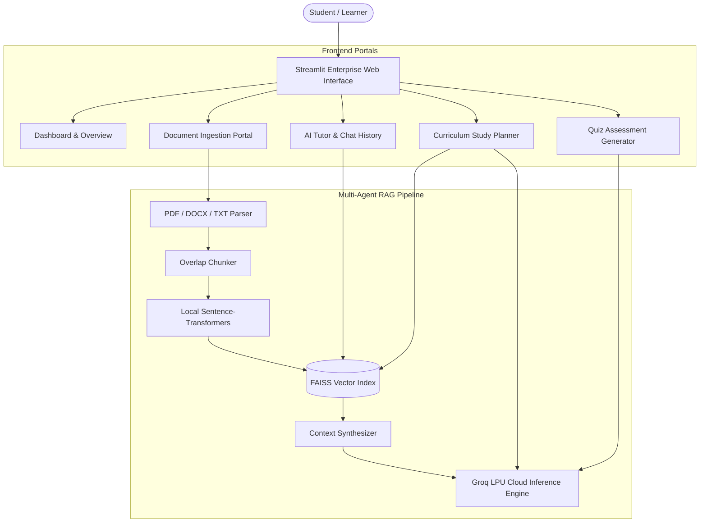

# 🎓 Learning Accelerator – Adaptive AI Academic Tutoring Platform

[](https://learning-accelerator.streamlit.app/)
[](https://www.python.org/)
[](https://streamlit.io/)
[](https://groq.com/)
[](https://github.com/facebookresearch/faiss)
[](LICENSE)
[](https://owasp.org/www-project-top-10-for-large-language-model-applications/)

> 🚀 **Live Production Application:** **[https://learning-accelerator.streamlit.app/](https://learning-accelerator.streamlit.app/)**

**Learning Accelerator** is an enterprise-grade, multi-agent AI academic tutoring and curriculum acceleration platform designed to provide personalized, grounded, and safe educational learning experiences. Built with **Streamlit**, **Groq LPU Inference**, **FAISS Vector Search**, and **Sentence-Transformers**.

---

## 🌐 Live Demo & Instant Access

You can directly test and interact with the platform without installing anything locally:

👉 **[Launch Learning Accelerator Live App](https://learning-accelerator.streamlit.app/)**

---

## 🌟 Core Highlights & Capabilities

### 1. 🤖 Intelligent Multi-Agent Architecture
- **AI Tutor (RAG Explainer Agent)**: 
  - Answers academic questions grounded directly in student-uploaded lecture slides, textbooks, and notes.
  - Multi-language intelligence with automatic language detection (UK English, US English, Roman Urdu, Urdu).
  - Answers out-of-scope general inquiries legally, ethically, and safely.
  - Interactive chat session management with full conversation history and deletion options.
- **Curriculum Planner Agent**:
  - Automatically detects uploaded course documents and extracts key chapters and syllabus topics.
  - Generates comprehensive, phased study roadmaps with milestone timelines, daily study commitments, and assessment checkpoints.
- **Quiz Assessment Generator Agent**:
  - Generates multi-choice diagnostic quizzes tailored to uploaded materials or custom subjects.
  - Instant score evaluation with detailed pedagogical rationale for each answer.
- **Progress Coach Agent**:
  - Monitors student quiz performance trends and offers personalized learning diagnostics.

### 2. ⚡ High-Speed, Local-First RAG Pipeline
- **Zero-Latency Embeddings**: Utilizes offline-cached `sentence-transformers/all-MiniLM-L6-v2` to eliminate external network rate-limit (HTTP 429) bottlenecks.
- **Sub-Second Vector Search**: Ingests and indexes **PDF**, **DOCX**, **TXT**, and **Markdown** documents with recursive boundary-aware chunking and FAISS vector indexing.
- **Multi-Document Selector**: Seamlessly switch between multiple uploaded study documents or formulate unified curriculum plans.

### 3. 🛡️ Enterprise Security & OWASP LLM Top 10 Compliance
- **LLM01 (Prompt Injection Resistance)**: Reference documents are treated as untrusted data; rejects malicious prompt overrides, privilege escalations, and unauthorized personas.
- **LLM05 (Improper Output Handling)**: Safe markdown rendering with strict sanitization; avoids execution of raw unvalidated scripts.
- **LLM07 (System Prompt Leakage Prevention)**: Safeguards internal instructions and system prompt definitions from extraction attempts.
- **Ethical Content Safeguards**: Strict guardrails preventing sexual or illegal content generation, with mandatory educational disclaimers for health and medical inquiries.

---

## 🏗️ System Architecture



---

## 🚀 Local Installation & Setup

### Prerequisites
- Python 3.10 or higher
- Groq API Key ([Get a free key at console.groq.com](https://console.groq.com/))

### Step 1: Clone the Repository
```bash
git clone https://github.com/usmancreation/learning-accelerator.git
cd learning-accelerator
```

### Step 2: Set Up Virtual Environment
```bash
# Windows
python -m venv .venv
.\.venv\Scripts\activate

# macOS / Linux
python3 -m venv .venv
source .venv/bin/activate
```

### Step 3: Install Dependencies
```bash
pip install -r requirements.txt
```

### Step 4: Configure API Key (Safe & Private)
Create `.streamlit/secrets.toml` in your project folder:
```toml
GROQ_API_KEY = "gsk_your_actual_groq_api_key_here"
```
*(Note: `.streamlit/secrets.toml` is automatically excluded by `.gitignore` to ensure your credentials are never pushed to GitHub).*

### Step 5: Run Application
```bash
streamlit run app.py
```
Open [http://localhost:8501](http://localhost:8501) in your browser.

---

## ☁️ Deployment on Streamlit Community Cloud

1. Fork or push this repository to your GitHub account: `https://github.com/usmancreation/learning-accelerator`.
2. Visit [share.streamlit.io](https://share.streamlit.io) and log in with GitHub.
3. Click **New app** and select:
   - **Repository:** `usmancreation/learning-accelerator`
   - **Branch:** `main`
   - **Main file path:** `app.py`
4. Open **Advanced Settings ➔ Secrets** and paste your API key:
   ```toml
   GROQ_API_KEY = "gsk_your_groq_api_key_here"
   ```
5. Click **Deploy**. Your app will be live with a dedicated URL!

---

## 📂 Repository Structure

```text
learning_accelerator/
├── .streamlit/
│   ├── config.toml               # Streamlit theme and server configuration
│   └── secrets.toml.example      # Example secrets template
├── assets/                       # Custom illustrations, icons, and UI assets
├── app.py                        # Complete monolithic application, agents, and UI
├── LICENSE                       # Official MIT Open Source License
├── README.md                     # Platform documentation and architecture overview
└── requirements.txt              # Production dependency specifications
```

---

## 📄 License

This project is licensed under the **MIT License** - see the [`LICENSE`](LICENSE) file for details.

---

## 👨‍💻 Author & Maintainer

**Usman Alam**
- GitHub: [@usmancreation](https://github.com/usmancreation)
- Live Platform: [learning-accelerator.streamlit.app](https://learning-accelerator.streamlit.app/)
- Repository: [github.com/usmancreation/learning-accelerator](https://github.com/usmancreation/learning-accelerator)